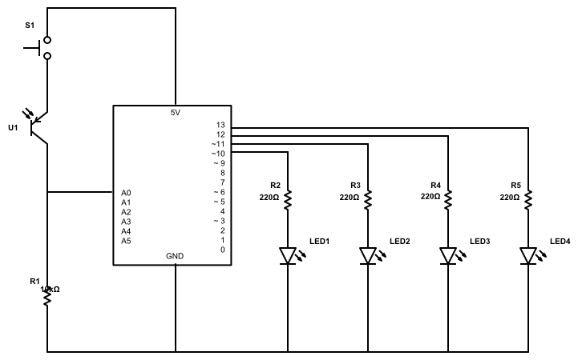

# Plant Light Sensor

This plant light sensor uses a photo transistor to give you a rough estimate of how much light your indoor plants are receiving.

## Ingredients
- 1 Arduino Uno
- 1 breadboard 400 points
- 1 [Photo Transistor HW5P-1](https://www.arduino.cc/documents/datasheets/HW5P-1.pdf)
- 4 [Yellow LEDs](https://www.arduino.cc/documents/datasheets/LEDY-L-7113YT.pdf)
- 1 [10k Ohm Resistor](https://www.arduino.cc/documents/datasheets/Resistors.pdf)
- 4 [220 Ohm Resistors](https://www.arduino.cc/documents/datasheets/Resistors.pdf)

## Background
There are four different types of light requirements for plants;
- Direct Light
    - West or South facing windows
    - Most intense light an indoor space can receive
- Bright Indirect Light
    - Not direct, but steady and bright
    - Light bounces off another surface before hitting plant
- Medium Light
    - Half the distance between a window and a back wall
    - Steady light from windows, but not direct
- Low Light
    - Seven or more feet from windows
    - Places that receive no natural light
    
... in Lux
- Direct Light
    - 2,000 - 4,000 lux (40% of the midday sun)
    - 4,000 - 5,000 lux (50%)
    - 5,000 lux or more (but < 10,000 lux, which is the full sun outdoors)
- Bright Indirect Light
    - 1,000 - 2,000 lux
- Medium Light
    - 500 - 1,000 lux
- Low Light
    - 200-500 lux
    
## How It Works

In this project a phototransistor is used to measure light intensity.
The phototransistor outputs a voltage in the range of 0 to 1023. 
Mapping the voltage value received to a range of 0 lux to 4,000 lux, a number of LEDs will light up in proportion to that lux value.

Example:
Medium Light (1,000 lux): 2 out of 4 LEDs are lit

To provide voltage to the phototransistor and start measuring light intensity a switch must be pressed down.

## Schematics
  
Source: https://schematics.io/draw
    
## Resources
Article: [The Best Light Intensity for Plants Indoors](https://www.sundaygardener.net/the-best-light-intensity-for-plants-indoors/)

